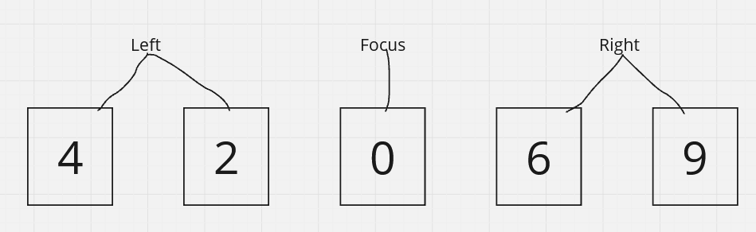

## 1. Introduction

Writing a brainfuck interpreter is a good little project when trying to learn a new programming language (or programming in general).
Because of that, the first trivial pet project I wrote as I learn OCaml is of course the brainfuck interpreter. In my case however,
I wanted to go as far as to make the interpreter purely function so as to reduce, or even remove potential side-effects, and to make
the code easier to reason about at a glance without having to worry about things like mutation.

In this mini tutorial, we will cover how to parse and evaluate brainfuck commands as well as wrap it into a simple command-line interface
to make it easier to test and play around with our interpreter. We're going to assume you already know how Brainfuck works and its eight commands,
otherwise you can just skim the [Wikipedia article](https://en.wikipedia.org/wiki/Brainfuck) to understand how it works.

### 1.1. Things I used here

+ [Angstrom](https://github.com/inhabitedtype/angstrom) - a parser combinator library, it's largely overkill for the purpose of parsing brainfuck
but I wanted to use it as a little *cheat* method for handling loops as well as easier testing.
+ [Base](https://github.com/janestreet/base) - standard library replacement for OCaml, I picked it up from reading *Real World Ocaml* when first learning
the language so the habit of using it just stuck with me. It still offers some extra functions not present in Stdlib but I don't think they'd be used much here.
+ [Core](https://github.com/janestreet/core) - much more featureful Stdlib replacement which extends Base. We'll be using its `Command` module to implement the CLI.

## 2. Somewhat overkill parsing

Let's first start by importing Angstrom to the file with:

```ml
open Angstrom
```

Next we need to define a variant type to represent the Brainfuck commands when we parse the raw text later on.

```ml
type bf_command =
  | MoveRight
  | MoveLeft
  | Increment
  | Decrement
  | Output
  | Input
  | Loop of bf_command list
```

Each type constructor corresponds to one of the eight Brainfuck commands (but with `Loop` representing both `[ and ]`)
Notice for the `Loop` constructor, we define it as a recursive constructor (it takes in other `bf_command` instances) and encases them in a list.
This is how we'll be handling the looping logic when we get to evaluating.

| Type constructor | BF command |
| :--------------- | ---------: |
| MoveRight | `>` |
| MoveLeft | `<` |
| Increment | `+` |
| Decrement | `-` |
| Output | `.` |
| Input | `,` |
| Loop | `[]` |

After that we can parse the first six Brainfuck commands to return their equivalent type constructors with Angstrom like so:

```ml
let move_right = char '>' *> return MoveRight

let move_left = char '<' *> return MoveLeft

let increment = char '+' *> return Increment

let decrement = char '-' *> return Decrement

let outpt = char '.' *> return Output

let inpt = char ',' *> return Input
```

Notice how `Loop` is still missing. We're not done here yet, the functions just mean it's taking char `x` as input and returning a corresponding
"signal" which we can't do anything with at the moment. We still need to implement how to "package" the signals into a container or format
that can be fed into the evaluation algorithm. Evidently, this is also how we're gonna handle loop expressions in brainfuck code.

```ml
let command : bf_command t =
  fix (fun command ->
      choice
        [ move_left
        ; move_right
        ; increment
        ; decrement
        ; outpt
        ; inpt
        ; (char '[' *> many command <* char ']' >>| fun cmds -> Loop cmds) ] )

let program = many command
```

Without going too much into detail, what `command` is saying is that a valid brainfuck can be any one of the seven functions in the list of parsers specified in the 3rd to 9th lines
of the code snippet. The last line of the `command` function is also how we're parsing loop expressions in brainfuck, basically any signals encased in between brackets returns a list
of said signals contained in a `Loop` instance. Lastly the `program` function essentially returns a list of valid commands which is what we'll be feeding into the evaluation function.

You might realize at this point that I didn't tackle bracket mismatches in the event it arises. There's quite a handful of ways to catch this error and gracefully fail the program,
can you fix this hole in the program?

If you have `utop` installed we can test that our parser works with the `Angstrom.parse_string` function like this:

```ml
utop # Angstrom.parse_string ~consume:All program "><+-.,[+-]";;
- : (bf_command list, string) result =
Ok
 [MoveRight; MoveLeft; Increment; Decrement; Output; Input;
  Loop [Increment; Decrement]]
```

Notice that the function returns the output wrapped in a `result` type, hence the `Ok` constructor meaning that the string was parsed correctly.
Also pay attention to how `Loop [Increment; Decrement]` creates its own list of signals nested within the container.

## 3. The zipper data structure

Since a brainfuck interpreter is modeled after the conceptual turing machine, we need a way to efficiently travel the tape in both directions without taking too much time.
This is where the zipper data structure comes to play, which will act as the tape of our purely functional interpreter.

Quoting the [Wikipedia article](https://en.wikipedia.org/wiki/Zipper_(data_structure)) on zippers:

> A zipper is a technique of representing an aggregate data structure so that it is convenient for writing programs
> that traverse the structure arbitrarily and update its contents, especially in purely functional programming languages.

Zippers are a kind of data structure which allows for purely functional and immutable traversal and update of items. It works by keeping 2 separate lists
and a *cursor* that points to the currently focused element in the data structure. The *left* list stores all elements that come sequentially before the
current cursor, and vice versa for the *right* list.

Normal list or arrays don't support true left traversal, instead requiring them to start from the head again and traverse all the way back to `l[n - 1]`. This
gives us a traversal operation of `O(n)` which is unnecessarily expensive for backtracking on a sequence.
Zippers don't have this problem on the other hand. In order to move in one direction you would:

  1. Take the current cursor value and move it to the head of the opposite list.
  2. Take the head of the target direction list and move it to the cursor.
  3. The new cursor is now the current focus of the zipper.

This ensures that bidirectional of adjacent members stay at `O(1)` time complexity.



Thankfully it's easy to represent a zipper structure in OCaml by defining it as a type.

```ml
type 'a zipper = {left: 'a list; focus: 'a; right: 'a list}
```

However, the `program` parser from awhile ago returns a list of brainfuck commands. For that we'll write a function that converts a list into a zipper.

```ml
let of_list l =
  match l with
  | [] ->
      failwith "Can't create zipper from empty list."
  | x :: xs ->
      {left= []; focus= x; right= xs}
```

As an optional exercise to the reader, how can you transform a zipper back into a list?

Now that zipper instantiation is done, we need to implement traversal on both directions of the zipper.

```ml
type direction = Left | Right

let move direction tape =
  match (direction, tape) with
  | Left, {left= _; focus= _; right= []} ->
      failwith "Already at max left bounds."
  | Left, {left= x :: xs; focus; right} ->
      {left= xs; focus= x; right= focus :: right}
  | Right, {left= _; focus= _; right= []} ->
      failwith "Already at max right bounds."
  | Right, {left; focus; right= x :: xs} ->
      {left= focus :: left; focus= x; right= xs}
  | _ ->
      failwith "Error: invalid move"
```

I think it's worth mentioning that the fallback case should never happen, but I still kept it there so the compiler doesn't complain about non-exhaustive patterns.

Back in `utop` we can test that the zipper and its functions work as intended.

```ml
utop # of_list [4;2;0;6;9];;
- : int/2 zipper = {left = []; focus = 4; right = [2; 0; 6; 9]}

utop # of_list [4;2;0;6;9] |> move Right;;
- : int/2 zipper = {left = [4]; focus = 2; right = [0; 6; 9]}

utop # of_list [4;2;0;6;9] |> move Right |> move Right;;
- : int/2 zipper = {left = [2; 4]; focus = 0; right = [6; 9]}

utop # of_list [4;2;0;6;9] |> move Right |> move Right |> move Left;;
- : int/2 zipper = {left = [4]; focus = 2; right = [0; 6; 9]}
```

## 4. Writing the interpreter algorithm

Now that all the setup is complete we can finally get on with writing the evaluation part of the interpreter. We can write the logic of the interpreter in one big function
`interpret` which instantiates the brainfuck tape (our zipper) and handles evaluation logic. We can start by instantiating our tape and loading up our parser.

```ml
let interpret cmds =
  let tape = List.init 30_000 ~f:(fun _ -> 0) |> of_list in
  let bf =
    Angstrom.parse_string ~consume:All program cmds
    |> function Ok l -> l | Error msg -> failwith msg
  in
  ...
```

After that we can define an inner `scan` function to evaluate the commands.

```ml
let rec scan tape bf =
    match bf with
    | [] ->
        tape
    | cmd :: rest ->
        let tape' =
            match cmd with
        ...
    in
    scan tape bf
```

For the anxious and impatient, you can skip to [section 4.5](#45-the-full-interpreter) for the full code.

### 4.1. Moving left and right

The most important part of the interpreter is traversing along the tape, we've already written the code for it earlier so:

```ml
match cmd with
          | MoveLeft ->
              move Left tape
          | MoveRight ->
              move Right tape
```

### 4.2. Incrementing and decrementing pointers

Next you'll need to increment and decrement the number value within the current cursor.

```ml
          | Increment ->
              {tape with focus= tape.focus + 1}
          | Decrement ->
              {tape with focus= tape.focus - 1}
```

Most brainfuck interpreters have a max memory of 255 per cell on their tape, additionally you shouldn't be allowed to store a negative integer on a cell.
As another optional exercise to the reader, can you handle these two error cases?

### 4.3. Input and output

Dealing with I/O is a bit more verbose in OCaml than something like say, Python. Don't forget to properly flush stdout when you're done with it!

```ml
          | Output ->
              printf "%c" (Char.of_int_exn tape.focus) ;
              Out_channel.flush Out_channel.stdout ;
              tape
          | Input -> (
              match In_channel.input_line In_channel.stdin with
              | Some line ->
                  let i = Int.of_string line in 
                  {tape with focus= i}
              | None ->
                  {tape with focus= 0} )
```

Most interpreters would prompt for an integer input between 0-255. Printing to output also involves decoding the integer to its equivalent ASCII code.

There are some things you can add here too. Like a symbol such as `->` to indicate that the program is prompting the user for an input, or how to properly fail the program
if the user adds a number not within the 0-255 range.

### 4.4. Handling loops

Lastly, we can handle loop expressions in brainfuck and end the evaluation logic like this:

```ml
          | Loop loop_cmds ->
              let rec loop tape =
                if tape.focus = 0 then tape else loop (scan tape loop_cmds)
              in
              loop tape
        in
        scan tape' rest
```

### 4.5. The full interpreter

Now that we've implemented the minimum required features of the evaluation logic (assuming you did not yet solve the optional items), let's piece all our code together!

```ml
let interpret cmds =
  let tape = List.init 30_000 ~f:(fun _ -> 0) |> of_list in
  let bf =
    Angstrom.parse_string ~consume:All program cmds
    |> function Ok l -> l | Error msg -> failwith msg
  in
  let rec scan tape bf =
    match bf with
    | [] ->
        tape
    | cmd :: rest ->
        let tape' =
          match cmd with
          | MoveLeft ->
              move Left tape
          | MoveRight ->
              move Right tape
          | Increment ->
              {tape with focus= tape.focus + 1}
          | Decrement ->
              {tape with focus= tape.focus - 1}
          | Output ->
              printf "%c" (Char.of_int_exn tape.focus) ;
              Out_channel.flush Out_channel.stdout ;
              tape
          | Input -> (
              match In_channel.input_line In_channel.stdin with
              | Some line ->
                  let i = Int.of_string line in
                  {tape with focus= i}
              | None ->
                  {tape with focus= 0} )
          | Loop loop_cmds ->
              let rec loop tape =
                if tape.focus = 0 then tape else loop (scan tape loop_cmds)
              in
              loop tape
        in
        scan tape' rest
  in
  scan tape bf
```

## 5. Trying out our interpreter

We can test and play around with our finished interpreter in `utop` before wrapping it into a proper program. I used [this](https://www.dcode.fr/brainfuck-language)
online Brainfuck interpreter to cross-reference with my own interpreter to check if it's correct.

This brainfuck sequence should print *"hey"*.

```ml
utop # interpret "++++++++++[>+>+++>+++++++>++++++++++<<<<-]>>>>++++.---.++++++++++++++++++++.";;
hey- : int zipper =
{left = [70; 30; 10; 0]; focus = 121;
 right =
  [0; 0; 0; 0; 0; 0; 0; 0; 0; 0; 0; 0; 0; 0; 0; 0; 0; 0; 0; 0; 0; 0; 0; 0; 0;
   0; 0; 0; 0; 0; 0; 0; 0; 0; 0; 0; 0; 0; 0; 0; 0; 0; 0; 0; 0; 0; 0; 0; 0; 0;
   0; 0; 0; 0; 0; 0; 0; 0; 0; 0; 0; 0; 0; 0; 0; 0; 0; 0; 0; 0; 0; 0; 0; 0; 0;
   0; 0; 0; 0; 0; 0; 0; 0; 0; 0; 0; 0; 0; 0; 0; 0; 0; 0; 0; 0; 0; 0; 0; 0; 0;
   0; 0; 0; 0; 0; 0; 0; 0; 0; 0; 0; 0; 0; 0; 0; 0; 0; 0; 0; 0; 0; 0; 0; 0; 0;
   0; 0; 0; 0; 0; 0; 0; 0; 0; 0; 0; 0; 0; 0; 0; 0; 0; 0; 0; 0; 0; 0; 0; 0; 0;
   0; 0; 0; 0; 0; 0; 0; 0; 0; 0; 0; 0; 0; 0; 0; 0; 0; 0; 0; 0; 0; 0; 0; 0; 0;
   0; 0; 0; 0; 0; 0; 0; 0; 0; 0; 0; 0; 0; 0; 0; 0; 0; 0; 0; 0; 0; 0; 0; 0; 0;
   0; 0; 0; 0; 0; 0; 0; 0; 0; 0; 0; 0; 0; 0; 0; 0; 0; 0; 0; 0; 0; 0; 0; 0; 0;
   0; 0; 0; 0; 0; 0; 0; 0; 0; 0; 0; 0; 0; 0; 0; 0; 0; 0; 0; 0; 0; 0; 0; 0; 0;
   0; 0; 0; 0; 0; 0; 0; 0; 0; 0; 0; 0; 0; 0; 0; 0; 0; 0; 0; 0; 0; 0; 0; 0; 0;
   0; 0; 0; 0; 0; 0; 0; 0; 0; 0; 0; 0; 0; ...]}
```

Since `interpret` returns an `int zipper` in addition to our IO effects, it also prints out the tape of our program so you can see how it works under the hood.

What happens when we give it an `Input` signal and enter the number 70?

```ml
utop # interpret ",.";;
70
F- : int zipper =
{left = []; focus = 70;
 right =
  [0; 0; 0; 0; 0; 0; 0; 0; 0; 0; 0; 0; 0; 0; 0; 0; 0; 0; 0; 0; 0; 0; 0; 0; 0;
   0; 0; 0; 0; 0; 0; 0; 0; 0; 0; 0; 0; 0; 0; 0; 0; 0; 0; 0; 0; 0; 0; 0; 0; 0;
   0; 0; 0; 0; 0; 0; 0; 0; 0; 0; 0; 0; 0; 0; 0; 0; 0; 0; 0; 0; 0; 0; 0; 0; 0;
   0; 0; 0; 0; 0; 0; 0; 0; 0; 0; 0; 0; 0; 0; 0; 0; 0; 0; 0; 0; 0; 0; 0; 0; 0;
   0; 0; 0; 0; 0; 0; 0; 0; 0; 0; 0; 0; 0; 0; 0; 0; 0; 0; 0; 0; 0; 0; 0; 0; 0;
   0; 0; 0; 0; 0; 0; 0; 0; 0; 0; 0; 0; 0; 0; 0; 0; 0; 0; 0; 0; 0; 0; 0; 0; 0;
   0; 0; 0; 0; 0; 0; 0; 0; 0; 0; 0; 0; 0; 0; 0; 0; 0; 0; 0; 0; 0; 0; 0; 0; 0;
   0; 0; 0; 0; 0; 0; 0; 0; 0; 0; 0; 0; 0; 0; 0; 0; 0; 0; 0; 0; 0; 0; 0; 0; 0;
   0; 0; 0; 0; 0; 0; 0; 0; 0; 0; 0; 0; 0; 0; 0; 0; 0; 0; 0; 0; 0; 0; 0; 0; 0;
   0; 0; 0; 0; 0; 0; 0; 0; 0; 0; 0; 0; 0; 0; 0; 0; 0; 0; 0; 0; 0; 0; 0; 0; 0;
   0; 0; 0; 0; 0; 0; 0; 0; 0; 0; 0; 0; 0; 0; 0; 0; 0; 0; 0; 0; 0; 0; 0; 0; 0;
   0; 0; 0; 0; 0; 0; 0; 0; 0; 0; 0; 0; 0; 0; 0; 0; 0; ...]}
```

It decodes to its ASCII character `F` and we can print it to stdout as intended.

## 6. Wrapping it into a CLI

What good is our interpreter if we can't use it like a proper program? Let's wrap it into a CLI program that takes a file as input, and parses and evaluates
its brainfuck codes. This is where importing `Core` comes in handy because its `Command` module has a nice interface for commandline parsing.

```ml
open Core
open Branefrick

let filter_bf code =
  String.filter code ~f:(fun c -> String.contains "><+-.,[]" c)

let run filename =
  let code = In_channel.read_all filename in
  let bf_code = filter_bf code in
  ignore @@ Evalbf.interpret bf_code

let command =
  Command.basic ~summary:"Evaluate Brainfuck from a file"
    ( Command.Param.(anon ("filename" %: string))
    |> Command.Param.map ~f:(fun filename -> fun () -> run filename) )

let () = Command_unix.run command
```

You might have noticed earlier that I didn't mention what to do with invalid characters which should be treated as code comments instead. I opted to just filter them out of the string
instead before feeding the processed input into the evaluator. Additionally, `Command_unix.run command` expects a `unit` type as input. `interpret` returns an `int zipper` instead of unit
even though it performs IO actions, this is why we `ignore` the function so that the expression correctly type checks to returning a `unit` type.

## 7. Conclusion

We ended this tutorial with a working Brainfuck interpreter written in OCaml, but there's still so much more you can add to this codebase. In addition to the optional exercises,
can you turn the interpreter into a [JIT compiler](https://youtu.be/mbFY3Rwv7XM) instead? That's already diving deeper into compiler design way beyond what's even needed for something
as simple as brainfuck. I found the code to still be rather messy and it could probably be optimized further, we still haven't tested this interpreter on more complex programs so far.

The full source code can be found here: <https://github.com/thonkpad/branefrick>
